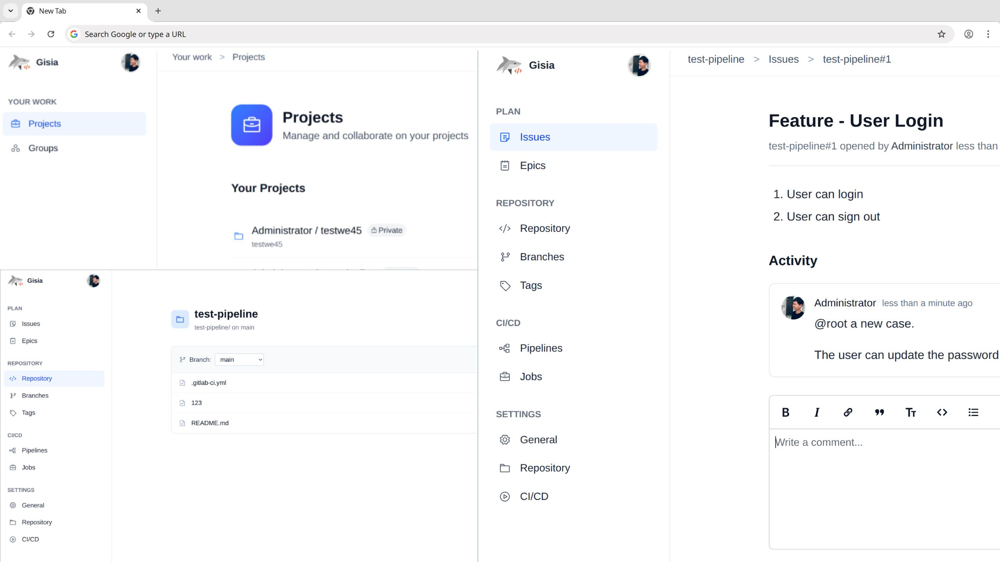

# Gisia

> **Self-hosted personal DevOps platform — lightweight, private, and fully yours.**

Gisia is an open-source, DevOps platform designed for individuals and small teams who want full control over their development workflow. It provides essential Git hosting, CI/CD automation, issue tracking.

<a href="README.md">English</a>
<a href="docs/i18n/zh_CN/README.md">简体中文</a>

> [!WARNING]
> ⚠️ Gisia is currently in **Alpha**.
> 
> That means it is under active development and may contain bugs or breaking changes between versions.

- **Regularly back up your repositories, configurations, and data — always before upgrading.**
- Features and APIs may change without notice.
- Use in production environments at your own risk

## 🚀 Features

| Feature | Status | Notes |
|----------|---------|-------|
| **User Authentication** | ✅ Done | Local accounts |
| **Git Repository Hosting** | ✅ Done | Lightweight Git server with SSH and HTTP(S) access |
| **CI/CD Pipelines** | ✅ Done | Basic runner support and pipeline definitions in YAML |
| **Issue Tracking** | 🔜 Working on| Simple issue board for personal or small team usage |
| **Merge Requests / Code Review** | 🔜 Planned | Inline diffs and comment threads |
| **Notifications System** | 💤 Not Planned Yet | Email or webhook-based alerts |

## 🛠️ Installation

[How To Install](docs/how-to/1-quick-start.md)

check the docs/releases to see how to upgrade to a specified version

## 💡 Dev Philosophy

Gisia is built with these principles in mind:

- **Developer-first design** — prioritizing tools and workflows that enhance developer productivity.
- **Transparency** — open source, auditable codebase.
- **Simplicity over complexity** — lightweight core, no heavy dependencies

## 🤝 Contributing

We welcome contributions from the community! You can help by **fixing bugs, improving code, or suggesting new features**.
All new features should start with an issue to discuss the idea.

### Legal Note
By contributing, you confirm that your contributions are your original work or that you have the right to submit them. All contributions are included under this **project’s license**.

Thank you for helping improve the project!

## 📄 License

This project is licensed under the **GNU Affero General Public License v3.0 (AGPLv3)**.

Please refer to the `NOTICE` and `.licenses` folders for detailed information on third-party licenses.

### ⚠️ Third-Party References Disclaimer

You may notice references to **"GitLab"** in server responses, logs, or internal messages.
These come from reused **GitLab FOSS (MIT-licensed) components** or code segments.

**Gisia is not affiliated with, endorsed by, or associated with GitLab Inc.**
All trademarks and brand names belong to their respective owners.
