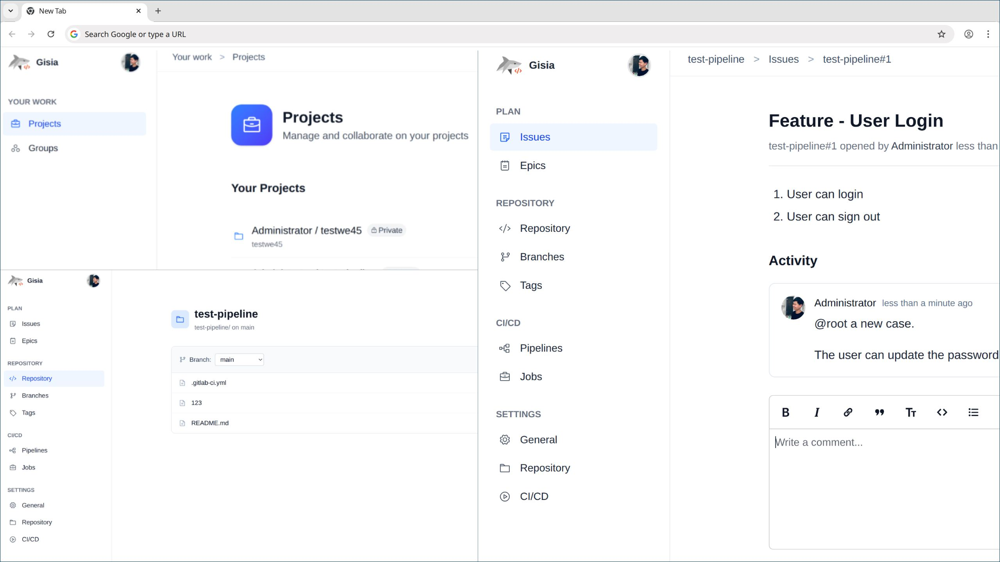

# Gisia

<a href="../../../README.md">English</a>
<a href="README.md">简体中文</a>

> **自托管个人 DevOps 平台 — 轻量级、隐私优先、自主可控。**

Gisia 是一个开源 DevOps 平台，为那些希望完全掌控开发工作流程的个人和小团队而设计。它提供基本的 Git 托管、CI/CD 自动化、问题跟踪等功能。

演示视频

<video src="https://github.com/user-attachments/assets/1a76184f-342b-4408-82e3-6dccc61cc76a"></video>

> [!WARNING]
> ⚠️ Gisia 目前处于 **Alpha** 阶段。
>
> 这意味着它正在积极开发中，可能存在漏洞或各个版本之间的破坏性变更。

- **定期备份你的仓库、配置和数据 — 升级前务必备份。**
- 功能和 API 可能会在没有通知的情况下改变。
- 在生产环境中使用需自行承担风险

## 🚀 功能

| 功能 | 状态 | 备注 |
|----------|---------|-------|
| **用户身份验证** | ✅ 已完成 | 本地账户 |
| **Git 仓库托管** | ✅ 已完成 | 轻量级 Git 服务器，支持 SSH 和 HTTP(S) 访问 |
| **CI/CD 流水线** | ✅ 已完成 | 基础 runner 支持和 YAML 格式的流水线定义 |
| **问题跟踪** | 🔜 开发中 | 简单的问题板，适合个人或小团队使用 |
| **合并请求 / 代码审查** | 🔜 计划中 | 内联对比和评论线程 |
| **通知系统** | 💤 暂未计划 | 基于邮件或 webhook 的警报 |

## 🛠️ 安装

[如何安装](../../how-to/1-quick-start.md)

查看 docs/releases 了解如何升级到指定版本

## 💡 开发哲学

Gisia 的构建遵循以下原则：

- **开发者优先设计** — 优先考虑能增强开发者生产力的工具和工作流程。
- **透明性** — 开源、可审计的代码库。
- **简洁胜于复杂** — 轻量级核心，无沉重依赖

## 🤝 贡献

我们欢迎社区的贡献！你可以通过**修复漏洞、改进代码或提出新功能建议**来帮助我们。
所有新功能应该从一个议题开始讨论想法。

### 法律说明
通过贡献，你确认你的贡献是你的原创作品，或者你有权提交它们。所有贡献都包含在本**项目的许可证**下。

感谢你帮助改进项目！

## 📄 许可证

本项目根据 **GNU Affero 通用公共许可证 v3.0 (AGPLv3)** 授权。

请参考 `NOTICE` 和 `.licenses` 文件夹以了解第三方许可证的详细信息。

### ⚠️ 第三方引用免责声明

你可能会在服务器响应、日志或内部消息中看到对 **"GitLab"** 的引用。
这些来自重用的 **GitLab FOSS（MIT 许可）组件**或代码段。

**Gisia 与 GitLab Inc. 无任何关联，亦未获得其认可或支持。**
所有商标和品牌名称均属于其各自所有者。
